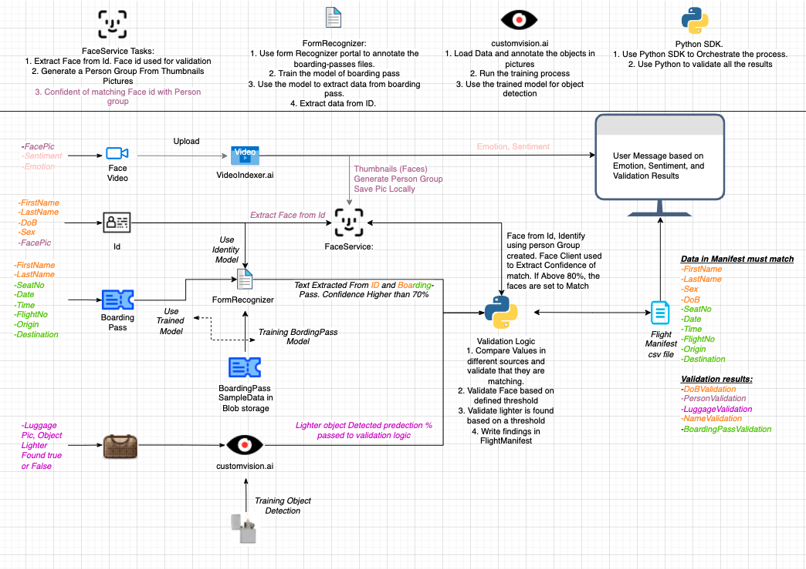
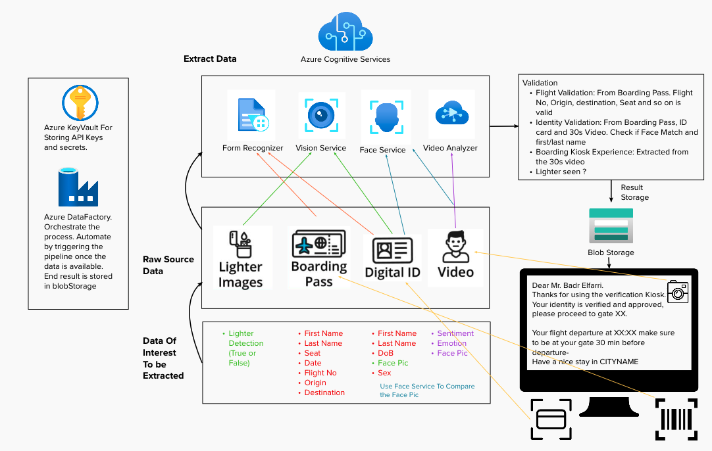

 <h1>  Project: Automated Passenger Boarding Kiosk   </h1> 

<h2> Overview of the project </h2>

    <h3> Project Definition and Solution Strategy </h3>
    

         
            In this project, we are going to emulate an automated passenger onboarding kiosk used in airports.
            The process will be conducted by passengers that look into a camera for the 30s to collect their facial details,
            and use a "scanner" to scan their Passport and their boarding pass. From this data, the following information will be extracted.
            <ul>
                <li> Emotion </li>
                <li> Identity </li>
                <li> Name and Date of birth </li>
                <li> Personal info and flight specific info. </li>
            </ul>
            see below for the overview of the project:
        
    

    

         
            To tackle this project Azure services will be used. Different azure services will be used to extract data from the different sources.
            There will be 3 different sources of data. Video, Id, and Boarding pass. 
            Azure computer vision, Face services, and video analyzer will be used to extract and match a passenger's face, furthermore extracting passengers' emotion. 
            While Azure form Recognizer will be used to extract information from identification cards and boarding passes.
            There will be also a task to build an Azure cognitive service-based computer vision for identifying lighter on the carry-on luggage of passengers.
            The process of validating the data collected is as described below:
            <ul>
                <li> Boarding Pass and ID: The text data collected will be cross-checked to check its validity. The flight details are presented to the user on the screen </li>
                <li> ID and Video: The id and video faces will be cross-matched to validate the passenger's identity </li>
                <li> Video: Collect the emotion of the passengers </li>
                <li> Other: Identifying a lighter in passengers luggage </li>
            </ul>
            Below a illustration of the data flow process that will be taken place behind the scene:
        
        

            
        

    

      

         
            The End Result and summary of the resources to be used is shown below. The passanger will be prompt a message with the process being succesfuel
            see picture below. The threshold for confidence level will differ, for face validation 80%, lighter detection 50%, text information 80%. As lighter
            is a critical thing flagging detection is important as passing the detection can be dangerous. Face and text detection is set high to avoid false detection
            leading to false verification.
        
        

            
        

    

